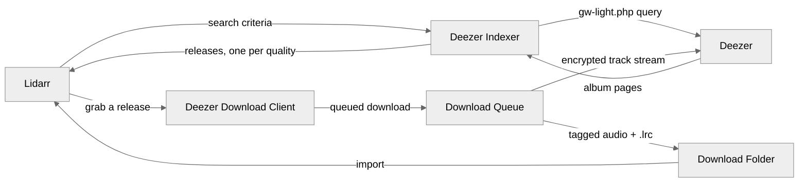

<h1 align="center">
  Deezer for Lidarr 🎵
</h1>
<p align="center">
  A <strong>Lidarr plugin</strong> that <em>turns a Deezer account into an automatically monitored music library</em>.
</p>

<br>

> [!WARNING]
> Deezer actively limits and bans accounts used by downloading tools. This plugin
> was not designed with that in mind, and no amount of care here removes the risk
> to your account.

## What is Deezer for Lidarr?

Lidarr tracks the albums you care about and fetches them as they appear. Out of the box it only knows how to talk to torrent and Usenet indexers. The usual way of getting Deezer into Lidarr is through Deemix — a second service that sits between the two. This plugin registers Deezer as both an **indexer** and a **download client** that talks to Deezer directly, so Lidarr can search the Deezer catalogue and pull MP3 128, MP3 320, and FLAC straight from it. Monitoring, quality profiles, renaming, and import all behave exactly as they do for any other source.

## Why use this? 🤔

A Deezer subscription already grants you the catalogue, but nothing connects it to a library you actually keep. The usual alternative is Deemix plus a browser tab — a second service to deploy, update, and debug when a download stalls, with files landed where your music server can find them.

With this plugin, adding an artist in Lidarr is the whole workflow. New releases are found, downloaded at the best quality your account is entitled to, tagged, and filed automatically — with no second service to run, and a failure showing up in Lidarr's own logs rather than somewhere else.

## Features 🚀

- 🎚️ **Every quality your account allows:** publishes MP3 128, MP3 320, and FLAC per album, gated on what Deezer says the account is entitled to.
- 🔍 **Deezer as a Lidarr indexer:** album searches run against Deezer and return one release per quality, so Lidarr can grade them against your quality profiles.
- 📥 **Automatic grabbing:** monitored albums download without intervention, through Lidarr's normal queue and import pipeline.
- 🏷️ **Tags and cover art written on the way in:** title, album, artist, date, track number, and embedded artwork, so imports land clean.
- 📝 **Lyrics, including synced `.lrc`:** taken from Deezer, with [LRCLIB](https://lrclib.net) as an optional fallback when Deezer has none.
- 🧹 **Albums with missing tracks hidden:** optional, on by default, so incomplete releases stay out of your search results.
- 📦 **Single-assembly install:** dependencies are merged into one DLL, so installing is one folder with one file in it.

## Architecture 🏗️



Note that the indexer and the download client are separate Lidarr providers — configuring one does not configure the other. The **indexer** holds the ARL: the download client is handed the originating indexer by Lidarr on every download and reads the ARL from there.

## How to Install ⚡

> [!TIP]
> New to this plugin? **[docs/SETUP.md](docs/SETUP.md)** is a step-by-step setup guide that walks through obtaining your ARL and flipping the two Lidarr settings that otherwise silently block downloads.

### Prerequisites 📦

- A Lidarr instance on the [`plugins` branch](https://wiki.servarr.com/lidarr/installation) — plugins do not load on `master`.
- An active [Deezer](https://www.deezer.com/) subscription, and its **ARL cookie** — the long `arl` value from your browser's cookies for `deezer.com` after logging in.

A `docker-compose.yml` on the plugins branch looks like this:

```yml
services:
  lidarr:
    image: ghcr.io/hotio/lidarr:pr-plugins
    container_name: lidarr
    environment:
      - PUID=1000
      - PGID=1000
      - TZ=Etc/UTC
    volumes:
      - /path/to/config:/config
      - /path/to/downloads:/downloads
      - /path/to/music:/music
    ports:
      - 8686:8686
    restart: unless-stopped
```

### Installing the plugin 🔌

1. In Lidarr, go to `System -> Plugins`, paste the repository URL into the GitHub URL box, and press **Install**. Restart Lidarr when it asks you to.

   ```
   https://github.com/jwmarb/Lidarr.Plugin.Deezer
   ```

2. Go to `Settings -> Indexers`, press **Add**, and choose **Deezer** (under *Other*, at the bottom).

3. Paste your ARL into **Arl**, press **Test** — it authenticates against Deezer and fails with a named reason when the ARL is missing, expired, or unentitled — then press **Save**.

4. Go to `Settings -> Download Clients`, press **Add**, and choose **Deezer** (again under *Other*). Set **Download Path**, and press **Test** — that is what confirms the field holds a path — then **Save**.

5. Go to `Settings -> Profiles`, find **Delay Profiles**, click the wrench on each one, and toggle **Deezer** on.

   Without this, every release is rejected with *"DeezerDownloadProtocol is not enabled for this artist."*

6. Optional but recommended: in `Settings -> Media Management`, enable **Rename Tracks** so each album lands in its own folder rather than loose in the artist directory.

7. Optional: to keep `.lrc` lyrics, enable **Import Extra Files** in the same screen and add `lrc` to the list.

### Settings 🔧

**Indexer**

| Setting | Default | Description |
| --- | --- | --- |
| `Arl` | — | Your Deezer ARL cookie. Required; it is the plugin's only credential. Masked in the UI, stored in the config. |
| `Hide Albums With Missing Tracks` | on | Omit albums that have unavailable tracks on Deezer. |
| `Early Download Limit` | none | Days before a release date that Lidarr may grab from this indexer. Advanced. |

**Download client**

| Setting | Default | Description |
| --- | --- | --- |
| `Download Path` | — | Where tracks are written before Lidarr imports them. Saving checks it is a valid path. |
| `Save Synced Lyrics` | `false` | Writes a `.lrc` file when synced lyrics exist. Needs `lrc` in Import Extra Files. |
| `Use LRCLIB as Backup Lyric Provider` | `false` | Falls back to LRCLIB when Deezer has no lyrics for a track. |

## Getting Your ARL 🔑

For a guided walkthrough of this and every other field, see **[docs/SETUP.md](docs/SETUP.md)**.

The ARL is Deezer's long-lived authentication cookie — a 192-character hex string, and a **full account bearer credential**: it grants exactly what your account grants (streaming, high quality, lossless) and nothing that it does not.

**Obtaining it is one browser step.** Sign in at [deezer.com](https://www.deezer.com/), open developer tools, and copy the value of the `arl` cookie under *Application → Cookies → `https://www.deezer.com`*. There is no API registration, no app id, no hash to compute.

Two things worth understanding, because both produce confusing symptoms:

- **The ARL can expire.** Deezer invalidates it — the web player regenerates it when you log in again — and an expired ARL authenticates as an *anonymous* session. **Test** catches that and names it; an ARL that worked at setup time can still stop working later, and the symptom is then a fresh authentication that fails, not a download that corrupts.
- **There is no auto-scraping.** Firehawk no longer publishes working tokens, so the plugin does not fetch an ARL for you. The browser cookie is the source, and it is the only credential the plugin needs.

The field is marked as a secret, so Lidarr masks it in the UI and the settings API — but it is stored in clear text in the config, so treat the config and the API as sensitive.

## Building from Source 🔨

```sh
git clone --recurse-submodules https://github.com/jwmarb/Lidarr.Plugin.Deezer
cd Lidarr.Plugin.Deezer
dotnet build src/*.sln -c Release \
  -p:AssemblyVersion=1.0.0 -p:FileVersion=1.0.0 -p:Deterministic=true
```

The version pin is not optional. `ext/Lidarr` stamps its assemblies
`10.0.0.*`, so an unpinned local build references a `Lidarr.Core` version that no
released Lidarr provides — the plugin then fails to load *and* takes other
installed plugins down with it. CI pins this already; local builds must do it by
hand. See [ADR-0010](docs/adr/0010-plugins-need-a-fixed-assembly-version.md).

The result lands in `_plugins/`. Copy the `.dll`, `.pdb`, and `.deps.json` into
`<lidarr-config>/plugins/jwmarb/Lidarr.Plugin.Deezer/` and restart Lidarr.

## Known Limitations ⚠️

- **The ARL can expire while the plugin is running.** Sessions are cached for the process lifetime, so an ARL that was valid at first use keeps serving its cached session after Deezer invalidates it — until Lidarr restarts and forces a fresh authentication. The expiry then surfaces as a named **Test** failure or as searches that return nothing.
- **The ARL is stored in clear text in the config.** It is masked in the UI and the settings API, but the stored value is a full account bearer credential, so treat the Lidarr config and its API as sensitive.
- **Search recall is capped by tier order.** The plain `artist album` query runs first, and the field-qualified refinement is tried only when it returns nothing — so an album the plain query matches only imperfectly is never re-queried with the more precise form.
- **A partially-failed album is reported as failed.** If some tracks download and others do not, the whole release is marked `Failed` rather than imported in part. Lidarr can then blocklist it and look for another source — but the tracks that did arrive are not kept.

## Architecture Notes 📐

[`CONTEXT.md`](CONTEXT.md) defines the project's vocabulary, and
[`docs/adr/`](docs/adr) records the decisions behind the current design and the
reasoning for each. Start there before changing the download queue, the
credential handling, or the release identity format.

## Licensing 📜

This plugin links [DeezNET](https://github.com/TrevTV/DeezNET), which is
**GPL-3.0**, and merges it into the shipped assembly — so the result is bound by
GPL-3.0 terms. The repository does not currently include its own license file.

These libraries are merged into the final plugin assembly, due to what appears to
be a bug in Lidarr's plugin system:

| Library | License |
| --- | --- |
| [DeezNET](https://github.com/TrevTV/DeezNET) | [GPL-3.0](https://github.com/TrevTV/DeezNET/blob/main/LICENSE) |
| [TagLibSharp](https://github.com/mono/taglib-sharp) | [LGPL-2.1](https://github.com/mono/taglib-sharp/blob/main/COPYING) |
| [AngleSharp](https://github.com/AngleSharp/AngleSharp) | [MIT](https://github.com/AngleSharp/AngleSharp/blob/devel/LICENSE) |
| [AngleSharp.XPath](https://github.com/AngleSharp/AngleSharp.XPath) | [MIT](https://github.com/AngleSharp/AngleSharp.XPath/blob/master/LICENSE) |
| [SkiaSharp](https://github.com/mono/SkiaSharp) | [MIT](https://github.com/mono/SkiaSharp/blob/main/LICENSE.md) |
| [BouncyCastle.Cryptography](https://github.com/bcgit/bc-csharp) | [MIT](https://github.com/bcgit/bc-csharp/blob/master/LICENSE.md) |

[Newtonsoft.Json](https://github.com/JamesNK/Newtonsoft.Json)
([MIT](https://github.com/JamesNK/Newtonsoft.Json/blob/master/LICENSE.md)) is
*not* merged — it resolves against the copy Lidarr already ships.

---

Maintained with ❤️ by Joseph Marbella.
