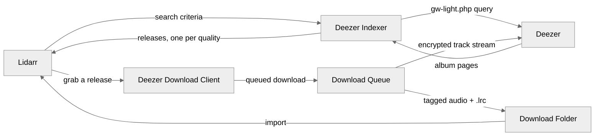

<h1 align="center">
  Lidarr.Plugin.Deezer 🎵
</h1>
<p align="center">
  A <strong>Lidarr indexer and download client</strong> that <em>pulls music straight from Deezer</em>, with no Deemix middleman to run.
</p>

<br>

> [!WARNING]
> Deezer actively limits and bans accounts used by downloading tools. This plugin
> was not designed with that in mind, and no amount of care here removes the risk
> to your account.

## What is Lidarr.Plugin.Deezer?

A plugin for Lidarr's `plugins` branch that adds Deezer as both a search source
and a download client. Lidarr searches Deezer directly, publishes each album at
every quality your account is entitled to, and writes tagged audio into your
library — all inside the Lidarr process.

## Why use it? 🤔

Other ways of getting Deezer into Lidarr put Deemix in the middle: a second
service to deploy, update, and debug when a download stalls. This talks to Deezer
itself, so there is one moving part instead of two, and a failure shows up in
Lidarr's own logs rather than somewhere else.

## Features 🚀

- 🔍 **Search and download in one plugin:** registers both a Deezer indexer and a Deezer download client, so grabbing a release needs no external tool.
- 🎚️ **Every quality your account allows:** publishes MP3 128, MP3 320, and FLAC per album, gated on what Deezer says the account is entitled to.
- 🏷️ **Tags and cover art written on the way in:** title, album, artist, date, track number, and embedded artwork, so imports land clean.
- 📝 **Lyrics, including synced `.lrc`:** taken from Deezer, with [LRCLIB](https://lrclib.net) as an optional fallback when Deezer has none.
- 🧹 **Albums with missing tracks hidden:** optional, on by default, so incomplete releases stay out of your search results.
- 📦 **Single-assembly install:** dependencies are merged into one DLL, so installing is one folder with one file in it.

## Architecture 🏗️



Note that the indexer and the download client are separate Lidarr providers that
both talk to Deezer — configuring one does not configure the other.

## How to Install ⚡

### Prerequisites 📦

- A Lidarr install on the [`plugins` branch](https://wiki.servarr.com/lidarr/installation) — plugins do not load on `master`.
- A Deezer account, and its ARL cookie — the long `arl` value from your browser's cookies for `deezer.com` after logging in.

A `docker-compose.yml` on the plugins branch looks like this:

```yml
services:
  lidarr:
    image: ghcr.io/hotio/lidarr:pr-plugins
    container_name: lidarr
    environment:
      - PUID=1000
      - PGID=1000
      - TZ=Etc/UTC
    volumes:
      - /path/to/config:/config
      - /path/to/downloads:/downloads
      - /path/to/music:/music
    ports:
      - 8686:8686
    restart: unless-stopped
```

### Steps

1. In Lidarr, go to **System → Plugins**, paste the repository URL into the GitHub
   box, and press **Install**.

   ```
   https://github.com/jwmarb/Lidarr.Plugin.Deezer
   ```

2. Go to **Settings → Indexers → Add**, choose **Deezer** (under *Other*, at the
   bottom), paste your ARL, and save.

3. Go to **Settings → Download Clients → Add**, choose **Deezer**, and set the
   download path.

4. Go to **Settings → Profiles → Delay Profiles**, open each profile, and toggle
   **Deezer** on. Releases are not grabbable until you do.

5. Optional but recommended: under **Settings → Media Management**, enable
   **Rename Tracks** so each album gets its own folder instead of everything
   landing in the artist folder.

6. Optional: to keep `.lrc` lyric files, enable **Import Extra Files** under
   **Settings → Media Management** and add `lrc` to the list.

### Settings 🔧

**Indexer**

| Setting | Default | Description |
| --- | --- | --- |
| `Arl` | — | Your Deezer ARL cookie. Required; searches return nothing useful without it. |
| `Hide Albums With Missing Tracks` | on | Omit albums that have unavailable tracks on Deezer. |
| `Early Download Limit` | none | Days before release date Lidarr may grab from this indexer. |

**Download client**

| Setting | Default | Description |
| --- | --- | --- |
| `Download Path` | — | Where tracks are written. Must be a path Lidarr can see. |
| `Save Synced Lyrics` | off | Write a separate `.lrc` file when synced lyrics exist. Needs `lrc` in Import Extra Files. |
| `Use LRCLIB as Backup Lyric Provider` | off | Fall back to LRCLIB when Deezer has no lyrics for a track. |

## Building from Source 🔨

```sh
git clone --recurse-submodules https://github.com/jwmarb/Lidarr.Plugin.Deezer
cd Lidarr.Plugin.Deezer
dotnet build src/*.sln -c Release \
  -p:AssemblyVersion=1.0.0 -p:FileVersion=1.0.0 -p:Deterministic=true
```

The version pin is not optional. `ext/Lidarr` stamps its assemblies
`10.0.0.*`, so an unpinned local build references a `Lidarr.Core` version that no
released Lidarr provides — the plugin then fails to load *and* takes other
installed plugins down with it. CI pins this already; local builds must do it by
hand. See [ADR-0010](docs/adr/0010-plugins-need-a-fixed-assembly-version.md).

The result lands in `_plugins/`. Copy the `.dll`, `.pdb`, and `.deps.json` into
`<lidarr-config>/plugins/jwmarb/Lidarr.Plugin.Deezer/` and restart Lidarr.

## Known Limitations ⚠️

- **FLAC files fail strict integrity checks.** Downloads carry trailing bytes past
  the end of the audio stream, so `flac -t` reports an error even though the audio
  plays correctly. The cause is upstream in DeezNET. See
  [ADR-0011](docs/adr/0011-truncate-before-tagging.md).
- **An invalid ARL is reported as valid.** The indexer's *Test* button passes even
  with an expired or junk ARL; the failure only surfaces later, as downloads that
  cannot fetch audio.
- **The ARL is stored and displayed in clear text.** It is a full account bearer
  credential, so treat the Lidarr config and its API as sensitive.
- **Search recall is capped by tier order.** The first query Lidarr tries is
  narrower than the fallback, and Lidarr only tries the fallback when the first
  returns nothing, so some legitimate albums are unreachable.
- **ARL auto-scraping is disabled.** Firehawk no longer publishes working tokens,
  so you must supply your own ARL.

## Architecture Notes 📐

[`CONTEXT.md`](CONTEXT.md) defines the project's vocabulary, and
[`docs/adr/`](docs/adr) records the decisions behind the current design and the
reasoning for each. Start there before changing the download queue, the
credential handling, or the release identity format.

## Licensing 📜

This plugin links [DeezNET](https://github.com/TrevTV/DeezNET), which is
**GPL-3.0**, and merges it into the shipped assembly — so the result is bound by
GPL-3.0 terms. The repository does not currently include its own license file.

These libraries are merged into the final plugin assembly, due to what appears to
be a bug in Lidarr's plugin system:

| Library | License |
| --- | --- |
| [DeezNET](https://github.com/TrevTV/DeezNET) | [GPL-3.0](https://github.com/TrevTV/DeezNET/blob/main/LICENSE) |
| [TagLibSharp](https://github.com/mono/taglib-sharp) | [LGPL-2.1](https://github.com/mono/taglib-sharp/blob/main/COPYING) |
| [AngleSharp](https://github.com/AngleSharp/AngleSharp) | [MIT](https://github.com/AngleSharp/AngleSharp/blob/devel/LICENSE) |
| [AngleSharp.XPath](https://github.com/AngleSharp/AngleSharp.XPath) | [MIT](https://github.com/AngleSharp/AngleSharp.XPath/blob/master/LICENSE) |
| [SkiaSharp](https://github.com/mono/SkiaSharp) | [MIT](https://github.com/mono/SkiaSharp/blob/main/LICENSE.md) |
| [BouncyCastle.Cryptography](https://github.com/bcgit/bc-csharp) | [MIT](https://github.com/bcgit/bc-csharp/blob/master/LICENSE.md) |

[Newtonsoft.Json](https://github.com/JamesNK/Newtonsoft.Json)
([MIT](https://github.com/JamesNK/Newtonsoft.Json/blob/master/LICENSE.md)) is
*not* merged — it resolves against the copy Lidarr already ships.
